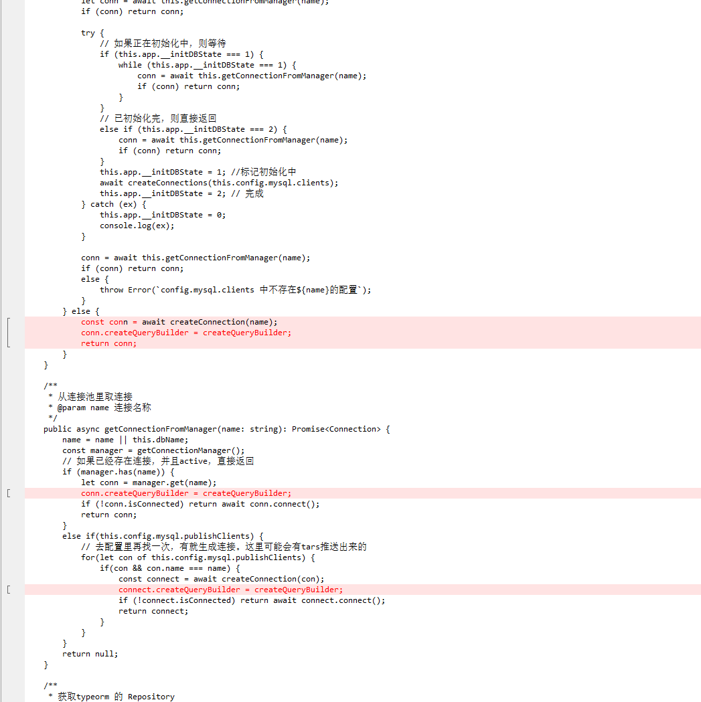

# 说明
为了解决正式环境DB查询中表名被加双反单引号的BUG，注入typeorm在表别名上不加引号

# 原理
这里主要是为了解决表别名加上`后，数据库报错。现改掉build内表别名删除escape
```js
_this.getTableName(destinationTableName) + " " + _this.escape(destinationTableAlias) 
```

# 引入
```
npm i jv-typeorm-builder
```

```js
import {
    createQueryBuilder
} from 'jv-typeorm-builder';
```

# 替换base.ts中的connection函数

所有生成connection的地方都需要替换:
```js
const conn = await createConnection(name);
conn.createQueryBuilder = createQueryBuilder;
```

  
